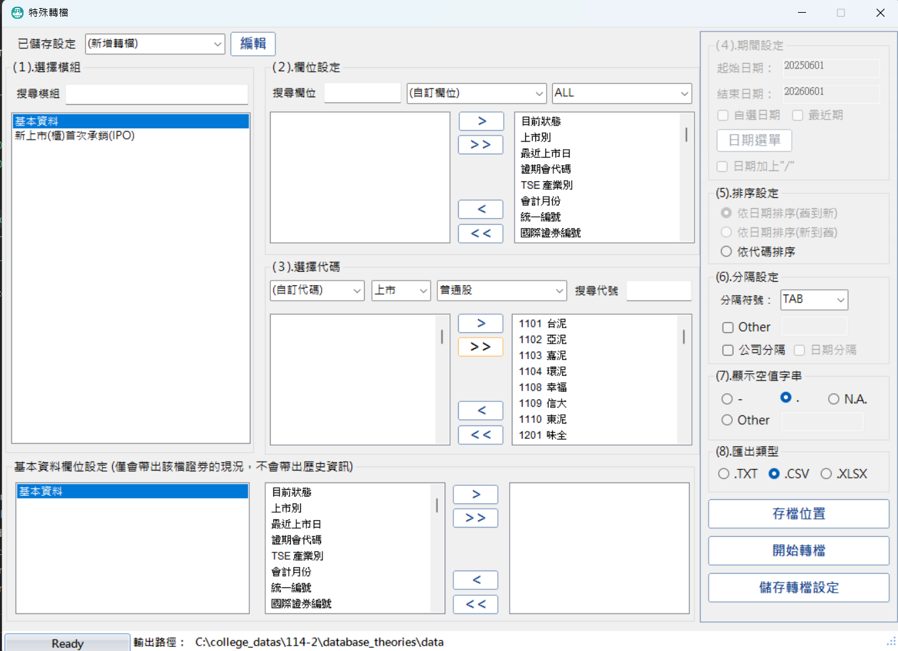

# data_import_tool

這個資料夾放的是本專案的資料清理與匯入工具。流程大致分成兩步：先把 TEJ 原始資料清理成統一格式，再把清理後的檔案匯入資料庫。

## 1. 專案簡介

本工具的目的，是把原始股票相關資料整理成資料庫可直接匯入的格式，並提供對應的匯入腳本。主要涵蓋三類資料：

- 股票基本資料
- 個股每日行情資料
- 暫停交易資料

清理後的檔案會放在 `clean_data/`，匯入腳本會直接讀取這些檔案並寫入資料庫。

## 2. 目錄與檔案說明

- `raw_data/`：原始資料檔。
- `clean_data/`：清理後、可直接匯入的檔案。
- `script/`：清理與匯入腳本。
- `script/log/`：腳本執行時輸出的 log。
- `Readme.md`：本說明文件。

主要腳本如下：

- `script/clean_stock.py`：清理股票基本資料。
- `script/clean_dailyprice.py`：清理每日行情資料。
- `script/clean_suspend.py`：清理暫停交易資料。
- `script/upload_stock.py`：匯入股票基本資料。
- `script/upload_dailyprice.py`：匯入每日行情資料。
- `script/upload_suspend.py`：匯入暫停交易資料。

## 3. 原始資料下載或放置位置

檔案均從 TEJ 下載 (或從 https://drive.google.com/file/d/1ICmkPCQwitVPo2Ri1tNW2S3NWWQXl2mw/view?usp=sharing 下載)，並放在 `raw_data/` 內。檔案名稱與內容格式需符合腳本預期，否則可能會導致清理失敗或資料不正確。



1. `stock.csv`：股票基本資料。從 TEJ 的 基本資料 下載，檔案格式會是 UTF-16 LE，不須手動更改沒關係，選擇代碼的部分選擇上市+普通股，分隔設定的分隔符號選 TAB (因為有些欄位有逗號)。

2. `dailyprice.csv`：每日行情資料。從 TEJ 的 未調整股價（日）下載，檔案格式會是 CP950，不須手動更改沒關係，欄位設定選擇 `開盤價(元),最高價(元),最低價(元),收盤價(元),成交量(千股),次日開盤參考價,次日漲停價,次日跌停價,注意股票(A),處置股票(D),全額交割(Y),市場別`，選擇代碼的部分選擇上市+普通股，分隔設定的分隔符號選逗號。

3. `suspend.csv`：暫停交易資料。從 TEJ 的 暫停交易紀錄 下載，檔案格式會是 UTF-16 LE，不須手動更改沒關係，選擇代碼的部分選擇上市+普通股，分隔設定的分隔符號選 TAB。

下載完後，請把這些檔案放在 `raw_data/` 內，並確保檔名與腳本預期一致。(或者你也可以改腳本參數指定不同檔名)

## 4. 資料流程

資料處理流程如下：

1. 將原始資料放入 `raw_data/`。
2. 執行對應的清理腳本，產生 `clean_data/` 裡的 TSV 檔。
3. 執行對應的匯入腳本，把清理後資料寫入資料庫。

每日行情資料會先依股票的上市日期過濾，避免匯入尚未上市前的資料。

## 5. 執行環境需求

- Python 3.10 以上。
- 已安裝專案所需套件。
- 可連線至 SQL API。

若有 `.env` 檔，工具會讀取其中的設定值。

## 6. 清理腳本使用方式

清理腳本都在 `script/` 內執行。常用參數如下：

- `-f, --filename`：指定原始資料檔。
- `--output`：指定清理後輸出檔。
- `-l, --limit`：只處理前幾筆資料。
- `-o, --out`：把終端輸出同步寫到 log 檔。
- `--quiet`：不在終端顯示 log。

三支清理腳本的工作內容如下：

### 6.1 `clean_stock.py`

這支腳本負責整理股票基本資料，輸入的是原始 `stock.csv`。它會先以 UTF-16 LE 讀取資料，將原始欄位轉成統一格式，再輸出成 `clean_data/stock.tsv`。處理內容包含：

- 解析證券代碼，抽出真正的 `stock_id`。
- 將公司中文簡稱、中文全稱、英文簡稱、英文全稱等欄位整理成資料庫需要的格式。
- 將上市別標準化成 `TSE`、`OTC`、`EMERGING` 或 `INDEX`。
- 將上市日期轉成 `YYYY-MM-DD`。
- 去除重複的 `stock_id`。
- 若尚未包含 `Y9999` 指數資料，會自動補上一筆加權指數資料。

這支腳本的重點是把原始股票主檔清成資料庫可直接匯入的版本，並確保主鍵與市場別欄位一致。

### 6.2 `clean_dailyprice.py`

這支腳本負責整理每日行情資料，輸入的是原始 `dailyprice.csv`。原始檔以 CP950 編碼讀取，輸出成 `clean_data/dailyprice.tsv`。它的工作不只是單純改欄位名稱，還會做幾個重要處理：

- 只保留市場別為 `TSE` 的資料，排除 OTC 與其他市場。
- 限定輸出日期區間為 `2023-01-03` 到 `2026-06-01`。
- 將日期、開高低收、成交量與布林標記轉成統一格式。
- 把前一筆資料中的「次日開盤參考價」、「次日漲停價」、「次日跌停價」帶到下一個交易日，符合 TEJ 的資料邏輯。
- 依股票的上市日期過濾，避免匯入上市前的交易資料。
- 去除明顯重複或不合法的資料列。

這支腳本是整個資料清理流程中最重要的一支，因為它同時處理市場別過濾、日期區間控制，以及每日行情欄位的對應關係。

### 6.3 `clean_suspend.py`

這支腳本負責整理暫停交易資料，輸入的是原始 `suspend.csv`，輸出成 `clean_data/suspend.tsv`。它會把原始資料清成只保留必要欄位的格式，主要處理內容如下：

- 解析證券代碼，抽出 `stock_id`。
- 將暫停交易開始日與恢復交易日統一轉成 `YYYY-MM-DD`。
- 保留暫停交易原因文字。
- 以 `stock_id + suspend_start_date` 為鍵去除重複資料。

這支腳本的結果會直接對應到資料表 `suspension_dates`，因此重點在於日期格式一致與重複資料清理。

範例：

```powershell
python .\clean_stock.py
python .\clean_dailyprice.py --quiet -l 1000
python .\clean_suspend.py -o .\script\log\clean_suspend.log
```

## 7. 匯入腳本使用方式

匯入腳本會讀取 `clean_data/` 內的檔案並寫入資料庫。常用參數如下：

- `-f, --filename`：指定要匯入的清理後檔案。
- `-l, --limit`：只匯入前幾筆資料。
- `-s, --start`：從指定偏移量開始匯入。
- `-u, --update`：主鍵衝突時更新既有資料。
- `-o, --out`：寫入 log 檔。
- `--quiet`：不在終端顯示 log。
- `--url`：指定 SQL API 位址。
- `--batch-size`：每批匯入的筆數。

### 7.1 `upload_stock.py`

匯入股票基本資料到 `project_main.stocks`。

```powershell
python .\upload_stock.py
python .\upload_stock.py --quiet -u
```

### 7.2 `upload_dailyprice.py`

匯入每日行情資料到 `project_main.daily_prices`。

若有指定 `-o`，會寫入 batch log，並在 log 最後附上最後一筆 CSV 原始資料。

```powershell
python .\upload_dailyprice.py -l 1000 -o .\script\log\upload_dailyprice.log -u
```

### 7.3 `upload_suspend.py`

匯入暫停交易資料到 `project_main.suspension_dates`。

```powershell
python .\upload_suspend.py
python .\upload_suspend.py --quiet
```

## 8. 執行順序建議

建議順序如下：

1. 先執行股票基本資料清理與匯入。
2. 再執行每日行情資料清理與匯入。
3. 最後執行暫停交易資料清理與匯入。

原因是每日行情與暫停交易資料都會依賴股票基本資料中的上市日期或主鍵資訊。

## 9. 常見問題

- 如果原始檔無法讀取，先檢查編碼是否正確。
- 如果匯入時出現 SQL API 錯誤，先確認 `--url` 或 `.env` 設定。
- 如果資料筆數不對，確認是否有使用 `-l` 或 `-s`。
- 如果終端太多輸出，可以加 `--quiet`。

## 10. 注意事項

- 清理後檔案以 UTF-8 編碼輸出。
- `upload_dailyprice.py` 會先比對股票上市日期，避免匯入不合法的交易日資料。
- `TIMESTAMP` 欄位會受資料庫時區影響；若要固定顯示台灣時間，需特別注意連線時區設定。
- `-o` 只控制是否寫 log 檔，`--quiet` 則控制是否在終端顯示 log。

