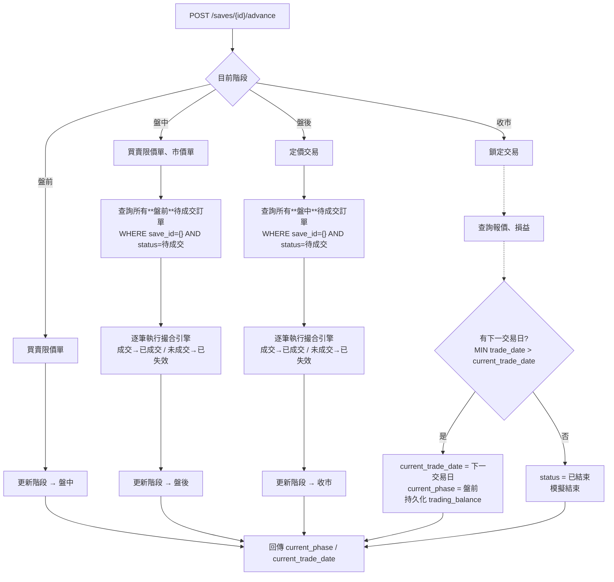

```mermaid
flowchart TD
    A[POST /saves/#123;id#125;/advance] --> B{目前階段}
    B -- 盤前 --> C[買賣限價單] --> C2[更新階段 → 盤中]
    
    B -- 盤中 --> D[買賣限價單、市價單]  --> D2[查詢所有**盤前**待成交訂單<br/>WHERE save_id=#123;#125; AND status=待成交] --> D3[逐筆執行撮合引擎<br/>成交→已成交 / 未成交→已失效] --> D4[更新階段 → 盤後]
    
    B -- 盤後 --> E[定價交易] --> E2[查詢所有**盤中**待成交訂單<br/>WHERE save_id=#123;#125; AND status=待成交] --> E3[逐筆執行撮合引擎<br/>成交→已成交 / 未成交→已失效] --> E4[更新階段 → 收市]
    
    B -- 收市 --> F[鎖定交易] -.-> F1[查詢報價、損益] -.-> F2{有下一交易日?<br/>MIN trade_date > current_trade_date}
    F2 -- 是 --> F3[current_trade_date = 下一交易日<br/>current_phase = 盤前<br/>持久化 trading_balance]
    F2 -- 否 --> F4[status = 已結束<br/>模擬結束]
    
    Z[回傳 current_phase / current_trade_date]
    C2 --> Z
    D4 --> Z
    E4 --> Z
    F3 --> Z
    F4 --> Z
```