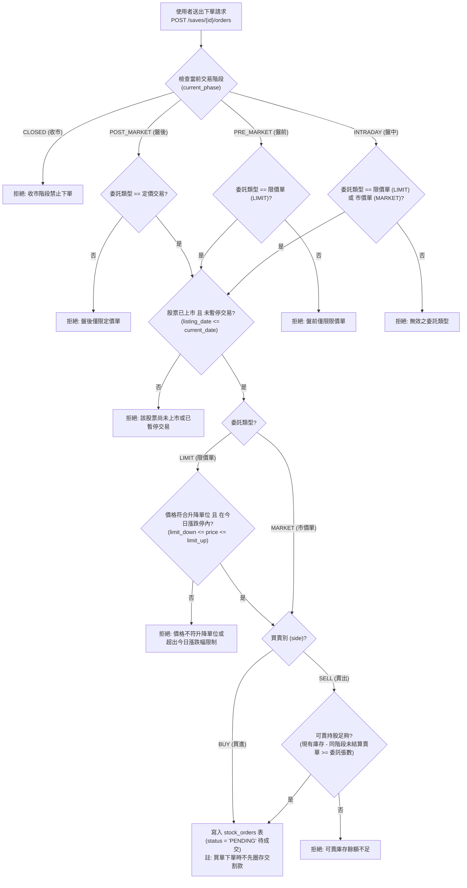
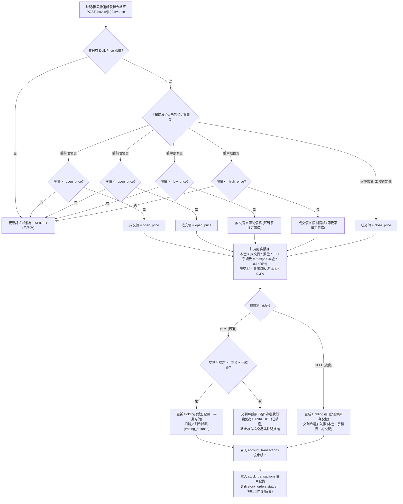

# 交易委託與撮合結算規範流程

## 1. 股票交易委託下單檢核流程圖

```mermaid
flowchart TD
    A["使用者送出下單請求<br/>POST /saves/{id}/orders"] --> B{"檢查當前交易階段<br/>(current_phase)"}
    
    B -- CLOSED (收市) --> R1["拒絕: 收市階段禁止下單"]
    
    B -- POST_MARKET (盤後) --> C1{"委託類型 == 定價交易?"}
    C1 -- 否 --> R2["拒絕: 盤後僅限定價單"]
    C1 -- 是 --> D
    
    B -- PRE_MARKET (盤前) --> C2{"委託類型 == 限價單 (LIMIT)?"}
    C2 -- 否 --> R3["拒絕: 盤前僅限限價單"]
    C2 -- 是 --> D
    
    B -- INTRADAY (盤中) --> C3{"委託類型 == 限價單 (LIMIT) 或 市價單 (MARKET)?"}
    C3 -- 否 --> R4["拒絕: 無效之委託類型"]
    C3 -- 是 --> D
    
    D{"股票已上市 且 未暫停交易?<br/>(listing_date <= current_date)"}
    D -- 否 --> R5["拒絕: 該股票尚未上市或已暫停交易"]
    D -- 是 --> E{"委託類型?"}
    
    E -- LIMIT (限價單) --> E1{"價格符合升降單位 且 在今日漲跌停內?<br/>(limit_down <= price <= limit_up)"}
    E1 -- 否 --> R6["拒絕: 價格不符升降單位或超出今日漲跌幅限制"]
    E1 -- 是 --> F
    E -- MARKET (市價單) --> F
    
    F{"買賣別 (side)?"}
    F -- BUY (買進) --> H["寫入 stock_orders 表<br/>(status = 'PENDING' 待成交)<br/>註: 買單下單時不先圈存交割款"]
    
    F -- SELL (賣出) --> G{"可賣持股足夠?<br/>(現有庫存 - 同階段未結算賣單 >= 委託張數)"}
    G -- 否 --> R7["拒絕: 可賣庫存餘額不足"]
    G -- 是 --> H
```

---

## 2. 撮合引擎盤後結算邏輯流程圖

```mermaid
flowchart TD
    M1["時間/階段推進觸發撮合結算<br/>POST /saves/{id}/advance"] --> M2{"當日有 DailyPrice 報價?"}
    M2 -- 否 --> X["更新訂單狀態為 EXPIRED (已失效)"]
    M2 -- 是 --> M3{"下單階段 / 委託類型 / 買賣別"}
    
    %% 撮合價格判斷
    M3 -- 盤前限價買 --> M4_pre_buy{"限價 >= open_price?"}
    M4_pre_buy -- 是 --> P_pre_buy["成交價 = open_price"]
    M4_pre_buy -- 否 --> X
    
    M3 -- 盤前限價賣 --> M4_pre_sell{"限價 <= open_price?"}
    M4_pre_sell -- 是 --> P_pre_sell["成交價 = open_price"]
    M4_pre_sell -- 否 --> X
    
    M3 -- 盤中限價買 --> M4_intra_buy{"限價 >= low_price?"}
    M4_intra_buy -- 是 --> P_intra_buy["成交價 = 限制價格 (即玩家指定限價)"]
    M4_intra_buy -- 否 --> X
    
    M3 -- 盤中限價賣 --> M4_intra_sell{"限價 <= high_price?"}
    M4_intra_sell -- 是 --> P_intra_sell["成交價 = 限制價格 (即玩家指定限價)"]
    M4_intra_sell -- 否 --> X
    
    M3 -- 盤中市價 或 盤後定價 --> P_close["成交價 = close_price"]
    
    %% 帳務與費用計算
    P_pre_buy --> Q["計算財務帳務:<br/>本金 = 成交價 * 數量 * 1000<br/>手續費 = max(20, 本金 * 0.1425%)<br/>證交稅 = 賣出時收取 本金 * 0.3%"]
    P_pre_sell --> Q
    P_intra_buy --> Q
    P_intra_sell --> Q
    P_close --> Q
    
    Q --> S{"買賣別 (side)?"}
    
    %% 買進結算
    S -- BUY (買進) --> T{"交割戶餘額 >= 本金 + 手續費?"}
    T -- 是 --> U["更新 Holding (增加股數、平攤均價)<br/>扣減交割戶餘額 (trading_balance)"]
    T -- 否 --> BANKRUPT["交割戶餘額不足: 存檔狀態變更為 BANKRUPT (已破產)<br/>終止該存檔交易與時間推進"]
    
    %% 賣出結算
    S -- SELL (賣出) --> V["更新 Holding (扣減/刪除庫存股數)<br/>交割戶增加入帳 (本金 - 手續費 - 證交稅)"]
    
    U --> Y["寫入 account_transactions 流水帳本"]
    V --> Y
    Y --> Z["寫入 stock_transactions 交易紀錄<br/>更新 stock_orders status = 'FILLED' (已成交)"]
```